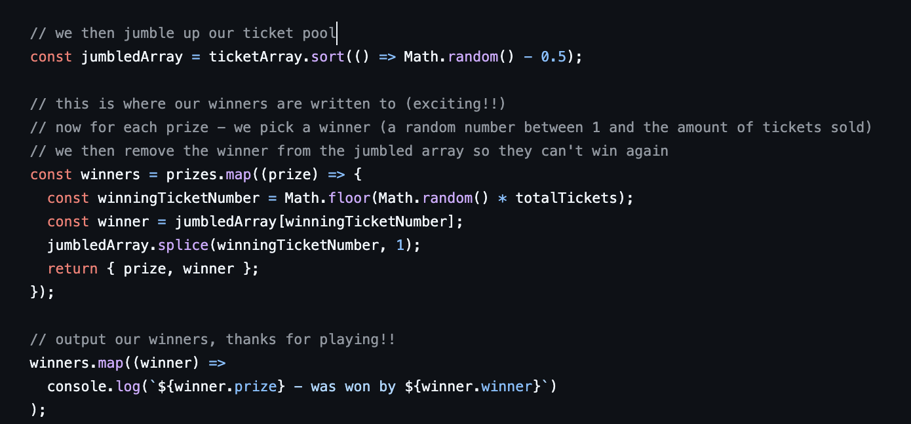

# raffle

Think this project will be named 'RaffleHur', but still undecided.

The goal of this application is to be a beautiful front end, that runs raffle logic utilising verifiably random numbers.

### Motivations

Last year, my brother started the 'Harry Hooper Ball'. Bit weird, but it was a ball to raise money for Movember. As a ball committee member, I was tasked with sorting out the raffle.

I more or less settled with this:

A simple script, that is available for viewing [here](https://github.com/hooperben/hhb-raffle-draw). This worked well, but, there is a trust assumption all built entirely around the call(s) to `Math.random()`.

`Math.random()` is ran as javascript on my laptop, but what if I had changed my local javascript executable to return an injected value, such that I could control who would win certain prizes?

Just to be clear, I didn't do this lol - but I think I could have. The point of this project is to demonstrate that we can completely eliminate this attack vector if we utilise random numbers available on public computers.

Another thing that I would like to improve, is that last year this was the output of the raffle being ran:

I really want to build this into a pretty site, where both:

- Raffle organisers can set/edit details of their raffle
- Ticket holders can view all of their tickets

As well as making it a super schmick UI, with abstracted accounts that are utilising public computer networks.
